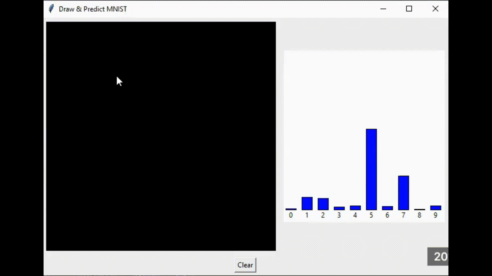

# Multilayer Perceptron Example

This project is an example for the MLP machine learning algorithm. It can train on the `MNIST_784` dataset and can also use it to predict the number a user draws.

The project comes packaged with a GUI you can use to check the prediction and the prediction calculated on my machine.

<p align="center">
  
</p>

## Requirements
- `Python v3.6` (or above) - this project uses type/variable annotation for clarity. The code itself was written and ran using Python v3.13.
- Make sure you install the required modules listed in the `requirements.txt` file, they are:
  - `numpy` for our model's calculations.
  - `scikit-learn` for loading the `MNIST_784` dataset.
  - `tk` for opening a window.
  - `pillow` for processing images on the window.

## How to run the project
To learn you can use the `mlp.py` file by running it with:

```py
python3 mlp.py
```

It will download the dataset, and fit the weights to it. It'll then save the weights into a file called `mlp_mnist.npz`.

If you just want to run the program however, this project provides pre-trained weights that you can find while cloning the directory. So you can run the paint app by doing:

```py
python3 app.py
```

## The Mathematics
If you are interested in learning about the actual mathematics of this project and how an MLP works without looking at the code you can [click here to open MLP.pdf](./MLP.pdf) a pdf file (that can be found in the directory's root folder) that explains the derivations in full.
